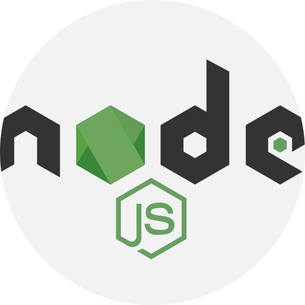
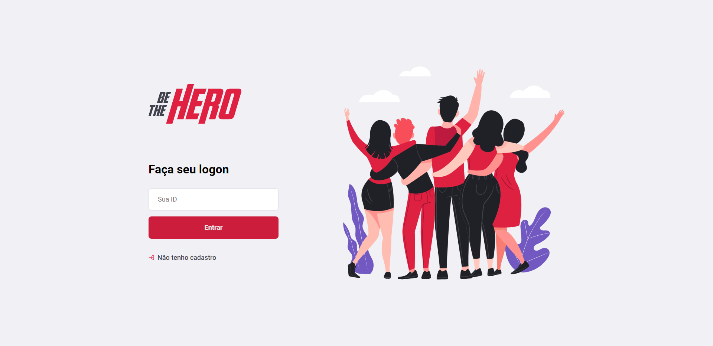

---

Projeto desenvolvido para aprimorar conhecimentos na area de desenvolvimento.

O projeto foi desenvolvido utilizando a linguagem EcmaScript(JavaScript) utilizando os frameworks  e ReactJS 

## Sobre o projeto

---

Be The Hero consiste em duas aplicações, uma API backend e um frontend ReactJS

A aplicação consiste em um CRUD de casos em ONGS para encontrar pessoas que tem disponibilidade para ajudar.

## Executando a aplicação

---

Faça um clone da base de codigo utilizando o `git clone`

Em um terminal execute o comando
`npm install` nas pastas backend e frontend para instalar as dependências do projeto.

Em seguida rode o comando `npm start` nas pastas backend e frontend e acesse via localhost:3000 no seu navegador.

Projeto desenvolvido no bootcamp Omnistack11 da 
